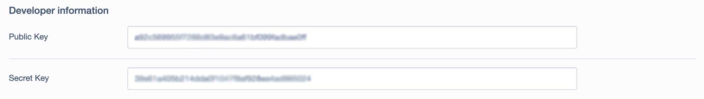
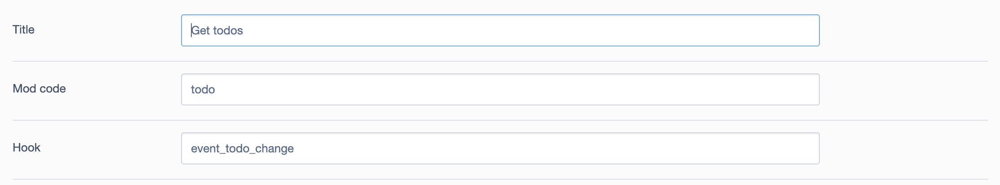
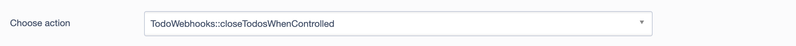

## Overview

🔌 **Connect to Microbizz**  
This module provides an interface to listen to one or more [Microbizz systems](https://microbizz.com/en), capture [complex objects](https://micropedia.microbizz.com/tec/complex-types) when commands are issued, and act upon them. You can also create custom interface endpoints to embed iframes in the Microbizz CRM system.

## Installation

📦 **Install via Composer**  
Run the following command to install the module:

```sh
composer require joelgrondrup/silverstripe-microbizz

```
After this run:

```sh
dev/build
```
🛠 **Configure the CMS**  
Once the database is built, you will see a button labeled "Microbizz Applications" in the CMS. Start by creating a Microbizz Application in the CMS by entering a public and secret key. Contact [Ventu](https://micropedia.microbizz.com/tec/making-a-microbizz-app) commercial support to obtain these keys.



### Activate Application

🔗 **Establish Connection**  
You must conduct a handshake with Microbizz to receive an access token, contract ID, and endpoint URL. Click "Activate" and follow the instructions. You may fill out hooks and interfaces before activating, but this can also be completed afterward.

After a successful handshake, the access token, endpoint, and contract fields should be populated.

### Enter User Information for API Requests

🔑 **API Credentials**  
Complete the configuration by providing an API key, username, and password, which should be created in the corresponding Microbizz system. This information will be beneficial when extending hooks and interfaces.

## Hooks for Event Endpoints

🔔 **Receive Events**  
To capture your first event objects from Microbizz, create a webhook and provide a mod and a hook code. Remember, hooks are necessary for obtaining event endpoint types.



You can add as many hooks as needed. Available events are listed [here](https://micropedia.microbizz.com/tec/making-a-microbizz-app#MakingaMicrobizzapp-Programmingendpoints). After adding event hooks, activate them by clicking "Activate" and follow the form in Microbizz.

Once data is received from Microbizz, use the "Event log" tab to view all incoming data, or check individual hooks to view events specific to each webhook.

### Working with Event Data

⚙️ **Customize Functionality**  
For each hook, you can craft custom functions that will be triggered when the hook is activated. All possible actions are listed in a dropdown under the "Actions" tab. To create these functions, extend the `BaseWebhook` class and add static functions.

#### Example

```php
<?php

class TodoWebhooks extends BaseWebhook {

    static function closeTodosWhenControlled($data, $params, $event) {

        // Perform actions

        $event->Log .= "Closed todo with ID {$data['id']}";
        $event->write();

    }

}
```



Every extension of the BaseWebhook should accept three parameters: data, params, and event. Data represents the information sent from Microbizz, params is an array of parameters from the Microbizz application, and event is the MicrobizzEvent object in SilverStripe. Modify the log in the CMS using this, which is particularly useful for debugging and detailing what transpired.

## Interface Endpoints

🎛 **Embed Interfaces**  
Interface endpoints are iframes embedded within the Microbizz CRM system at various locations. They are referred to as "interfaces" in the [documentation](https://micropedia.microbizz.com/tec/making-a-microbizz-app#MakingaMicrobizzapp-Programmingendpoints). To create an interface endpoint, extend the `BaseInterfaceEndpoint` class and implement a static function with parameters: `data` and `params`.

`Data` includes the GET parameters from the iframe, while `params` is an array that contains the Microbizz application parameters, session token result, interface, and application objects.

### Example

```php
<?php

use SilverStripe\Control\Controller;

class TodoInterface extends BaseInterface {

    static function showMyCustomTodoTab($data, $params) {

        $controller = Controller::curr();

        return $controller->renderWith("MyCustomTodoTabInterface");

    }

}
```

## License

📜 **MIT License**  
This module is licensed under the MIT license.